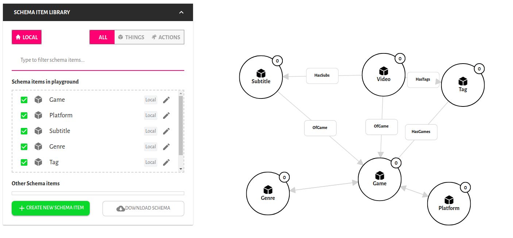
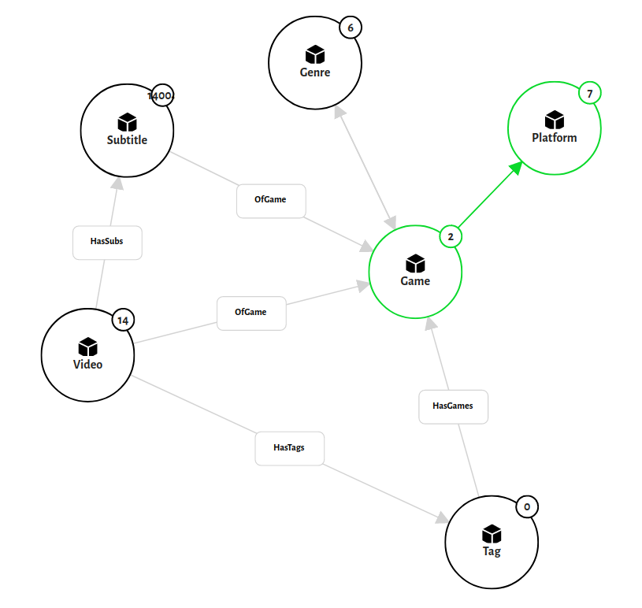

# Game Walkthroughs Weaviate demo  

A Weaviate demo dataset with game walkthroughs.

## Build Status

| Branch   | Status        |
| -------- |:-------------:|
| Master   | [](https://travis-ci.com/semi-technologies/weaviate-python-client)

## Running the demo

- Requirement
  - python 3 and venv
  - `docker` and `docker-compose` are installed

- Spin up the compose
  ```
  docker-compose up -d
  ```
    
  It may take a while to download the image. 
  After the service is up we still need some time until weaviate is reachable by url (around 30 secs-1 minute).
  To check if the graph is reachable, simply open `http://localhost:8080/` and see if there is any response from the graph.
    
  While waiting for it, we can configure the data seed.

- Configure how we populate the data
  - game data
    - We can populate the game data inside the [games](project/data/games) file
    - Game data is formatted as: [Game name];[Developer name];[Genre(s) - comma separated];[Platform(s) - comma separated]
    - Example:
      ```
      GTA V;Rockstar Games;Action-adventure Game,First-person Shooter;PlayStation 3,PlayStation 4,PlayStation 5,Xbox One,Xbox 360,Xbox Series X,Microsoft Windows
      ```
      
      This will later be interpreted as:
        - create a Game instance named GTA V with developer of Rockstar Game
        - create 2 genres of Action-adventure Game and First-person Shooter, and later associate both of it with GTA V
        - create 7 platforms and associate all of it with GTA V
        
    - All creation are `get_or_create` method, so same instance will not be duplicated.

  - video links
    - We can populate the video data using [video_links](project/data/video_links) file
    - Game data is formatted as: [Game name];[Video link from Youtube]
    - example: `GTA V;https://www.youtube.com/watch?v=Vncf_9LLagc`
    - The script will get the video's metadata and auto subs using `youtube-dl`, create an instance inside the graph and associate with the Game

- Running the script
  - create python 3 venv, get into it, and install all the requirement
    ```
    pip3 install -r requirements.txt
    ```
  
  - make sure that weaviate is reachable by opening `http://localhost:8080/`, if there is any 200 response then it should be good
  - Create the schema by running `create_schema.py`:

    ```
    python3 project/create_schema.py
    ```
  
    By now, if you open the [weaviate playground](http://playground.semi.technology/?weaviate_uri=http%3A%2F%2Flocalhost%3A8080%2Fv1%2Fgraphql) pointed on your localhost and check all the schema you will see something like this:
  
    

  - Populate the schema by running `populate schema.py`
  
    ```
    python3 project/create_schema.py
    ```
  
    It will take quite a moment according how much the videos is listed and duration of each video.
  
    After done, we will get soemthing like this:
  
    

  We can now query or explore the data.
